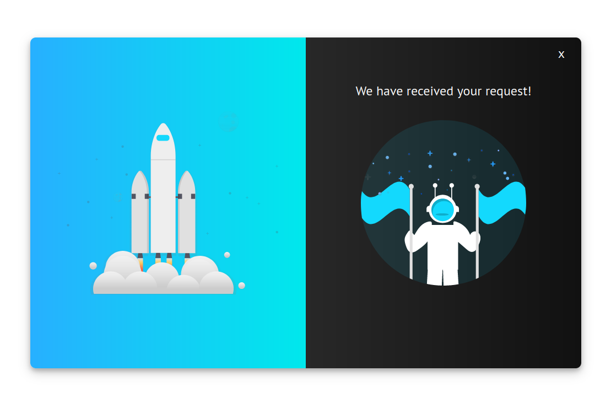

# React Form Validation

## 💻 Projeto

Projeto desenvolvido com base no vídeo [React Form Validation Using Custom Hooks Tutorial - Beginner React JS Project][video], oferecido por [Brian Design][channel].

## 🛠 Tecnologias

As seguintes tecnologias foram utilizadas no desenvolvimento do projeto:

- [React][react]

## 📷 Screenshots

<kbd>
  
</kbd>

<kbd>
  
</kbd>

[video]: https://www.youtube.com/watch?v=KGFG-yQD7Dw
[channel]: https://www.youtube.com/channel/UCsKsymTY_4BYR-wytLjex7A
[react]: https://reactjs.org/
